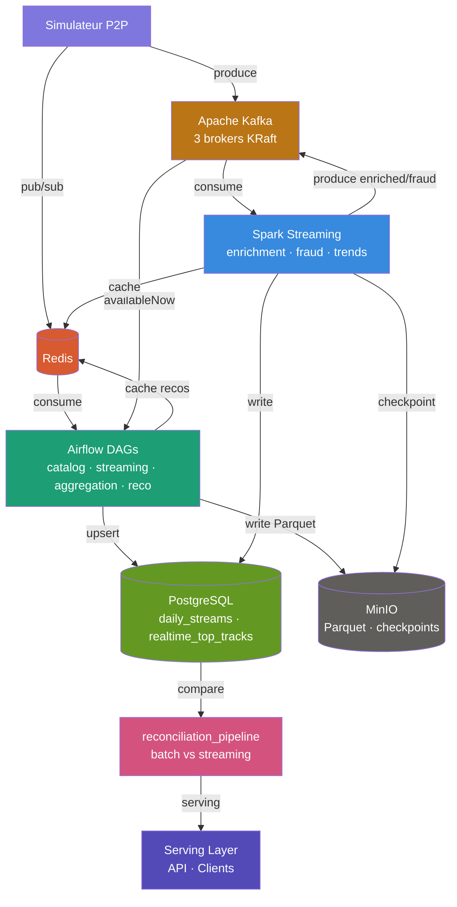
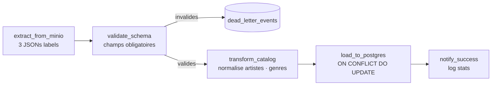
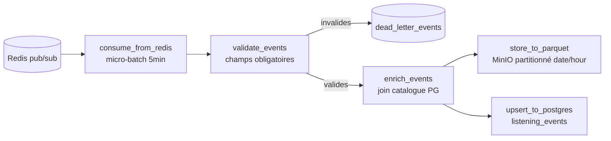
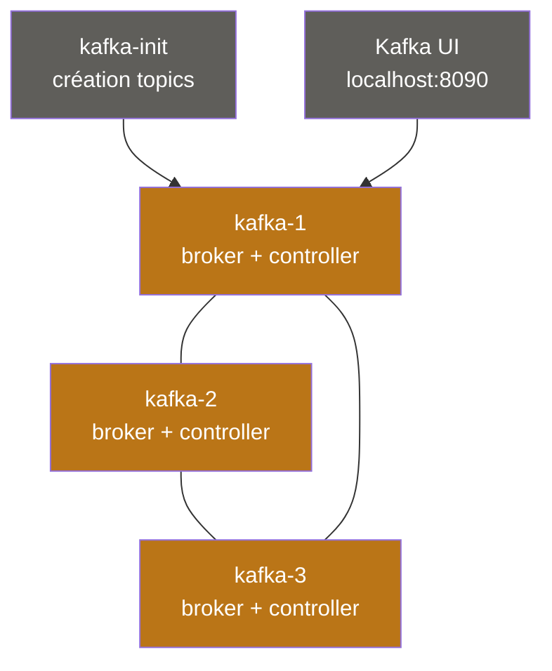
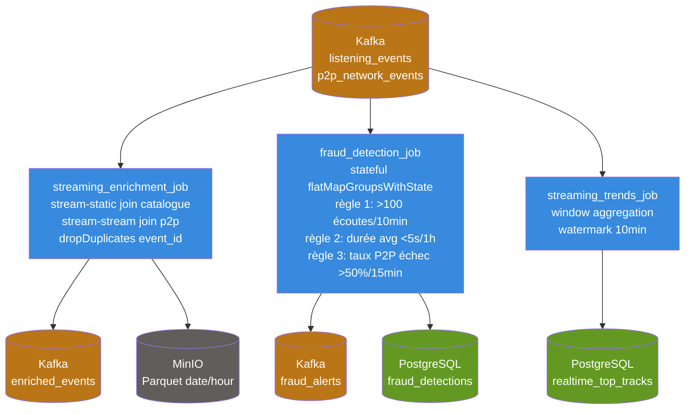

# Architecture Lambda — Plateforme Spotify

## Vue d'ensemble



---

## Architecture Lambda — Batch + Speed Layer

```
Speed layer  : Simulateur → Kafka → Spark ──────────────► PostgreSQL (realtime_top_tracks)
                                        └──────────────► Redis (cache)
                                        └──────────────► MinIO (checkpoints)

Batch layer  : Simulateur → Redis ──► Airflow ──────────► PostgreSQL (daily_streams)
                         → Kafka (availableNow) ────────► MinIO (Parquet)
                                                ────────► Redis (reco:{user_id})

Serving layer: PostgreSQL + Redis ◄── API clients
                    ↑
         reconciliation_pipeline (compare batch vs streaming, alerte si divergence > 5%)
```

---

## Phase 1 — Batch Airflow

### DAGs

| DAG | Rôle | Fréquence | Pattern |
|-----|------|-----------|---------|
| `catalog_ingestion_pipeline` | MinIO JSON → normalise → upsert PostgreSQL | @daily | ETL |
| `streaming_events_pipeline` | Redis pub/sub → enrich → Parquet + PostgreSQL | @every 5min | ETL |
| `aggregation_pipeline` | Top 50 tracks, artist stats, métriques P2P | @daily | ELT |
| `recommendation_pipeline` | Collaborative filtering (cosine similarity) → Redis TTL 24h | @daily | ETL |
| `dlq_reprocessing_pipeline` | Retraitement dead_letter_events (max 3 tentatives) | @hourly | ETL |
| `late_events_reprocessing` | Late events Kafka → revalider → PostgreSQL | @hourly | ETL |
| `reconciliation_pipeline` | Divergence batch vs streaming, alerte si > 5% | @every 2h | ELT |

### Flux catalog_ingestion_pipeline



### Flux streaming_events_pipeline



---

## Phase 2 — Streaming Kafka / Spark

### Cluster Kafka KRaft



### Topics Kafka

| Topic | Partitions | Réplication | Clé | Justification |
|-------|-----------|-------------|-----|---------------|
| `listening_events` | 6 | 3 | `user_id` | Ordre garanti par utilisateur — essentiel pour fraud detection stateful |
| `p2p_network_events` | 6 | 3 | `peer_id` | Métriques réseau par nœud P2P |
| `enriched_events` | 6 | 3 | `user_id` | Output Spark enrichment |
| `fraud_alerts` | 3 | 3 | `user_id` | Alertes fraud par utilisateur |
| `late_listening_events` | 3 | 3 | `user_id` | Events tardifs rejetés par watermark |
| `catalog_updates` | 3 | 3 | `track_id` | Log compaction activée |

### Jobs Spark



### Watermarking et Exactly-Once

```mermaid
flowchart LR
    P[Producteur P2P\nenable.idempotence=True\nacks=all\ntransactional.id=p2p-sim-1] --> K[(Kafka)]
    K --> S[Spark\nisolation.level=read_committed\ncheckpoints MinIO]
    S --> PG[(PostgreSQL\nON CONFLICT DO NOTHING)]
    S -->|late events| L[(Kafka\nlate_listening_events)]
    L --> A[Airflow\nlate_events_reprocessing\n@hourly]
    A --> PG

    style P  fill:#7F77DD,color:#fff
    style K  fill:#BA7517,color:#fff
    style S  fill:#378ADD,color:#fff
    style PG fill:#639922,color:#fff
    style L  fill:#BA7517,color:#fff
    style A  fill:#1D9E75,color:#fff
```

---

## Modèle de données — Tables PostgreSQL

| Table | Couche | Description |
|-------|--------|-------------|
| `artists` | Batch | Catalogue artistes (upsert idempotent) |
| `tracks` | Batch | Catalogue tracks |
| `listening_events` | Batch + Streaming | Événements d'écoute (index sur timestamp + date_trunc hour) |
| `daily_streams` | Batch | Top 50 tracks par jour |
| `artist_stats` | Batch | Streams + unique_listeners par artiste |
| `realtime_top_tracks` | Streaming | Top tracks temps réel (Spark) |
| `recommendations` | Batch | Top-10 recos par utilisateur |
| `dead_letter_events` | Batch | Events défectueux (payload JSONB, status pending/reprocessed/abandoned) |
| `fraud_detections` | Streaming | Alertes fraude (Spark fraud_detection_job) |
| `reconciliation_reports` | Batch | Rapports divergence batch vs streaming |

---

## Partitionnement Parquet sur MinIO

```
spotify-parquet/
└── listening_events/
    └── date=2025-01-15/
        └── hour=14/
            └── part-00000.parquet

spotify-checkpoints/
└── streaming_enrichment_job/
└── fraud_detection_job/
└── streaming_trends_job/

labels-raw/
└── sunset_records.json
└── rising_star.json
└── urban_beats.json
```

**Pourquoi `date/hour` ?**
- Le partition pruning évite de scanner tout le bucket pour une requête sur une fenêtre horaire
- Compatibilité avec les DAGs Airflow (Phase 1) et les jobs Spark (Phase 2)
- Le DAG `streaming_events_pipeline` écrit par micro-batch de 5 min → une partition par heure reste gérable

---

## Schémas d'événements

### listening_event
```json
{
  "event_id":     "uuid",
  "user_id":      "uuid",
  "track_id":     "uuid",
  "source_peer":  "uuid",
  "timestamp":    "2025-01-15T14:30:00Z",
  "duration_ms":  45000,
  "device_type":  "mobile",
  "geo_country":  "FR",
  "completed":    true,
  "event_source": "p2p"
}
```

### p2p_network_event
```json
{
  "event_id":          "uuid",
  "event_type":        "chunk_transfer",
  "peer_id":           "uuid",
  "target_peer":       "uuid",
  "track_id":          "uuid",
  "chunk_size_bytes":  65536,
  "latency_ms":        12,
  "timestamp":         "2025-01-15T14:30:01Z"
}
```

### fraud_alert
```json
{
  "alert_id":        "uuid",
  "user_id":         "uuid",
  "rule_triggered":  "bot_stream",
  "suspicion_score": 0.92,
  "window_start":    "2025-01-15T14:00:00Z",
  "window_end":      "2025-01-15T14:10:00Z",
  "details":         "143 écoutes en 10 minutes"
}
```

---

## Leçons apprises

- **Lundi** : L'ordre de démarrage Docker Compose est critique — Airflow webserver démarre après le scheduler (~60s). Les 11 tables PostgreSQL et les 3 buckets MinIO doivent exister avant de lancer les DAGs.
- **Mardi** : L'idempotence est non-négociable. `ON CONFLICT DO UPDATE` côté PostgreSQL et la vérification des fichiers Parquet existants côté MinIO sont les deux patterns à systématiser dans chaque DAG.
- **Mercredi** : Kafka KRaft sans ZooKeeper simplifie le setup mais les 3 brokers doivent partager le même `KAFKA_CLUSTER_ID`. Le réseau Docker doit être explicitement défini pour que les brokers se trouvent mutuellement.
- **Jeudi** : Le watermarking Spark (`.withWatermark("event_time", "10 minutes")`) est le mécanisme clé pour gérer les late events sans garder un état infini en mémoire. L'exactly-once bout-en-bout repose sur trois verrous : idempotence producteur + `read_committed` consommateur + checkpoints MinIO.
- **Vendredi** : La réconciliation batch/streaming révèle les écarts inhérents à l'architecture Lambda. Une divergence < 5% est acceptable ; au-delà, c'est souvent un watermark trop court ou une DLQ non retraitée.
